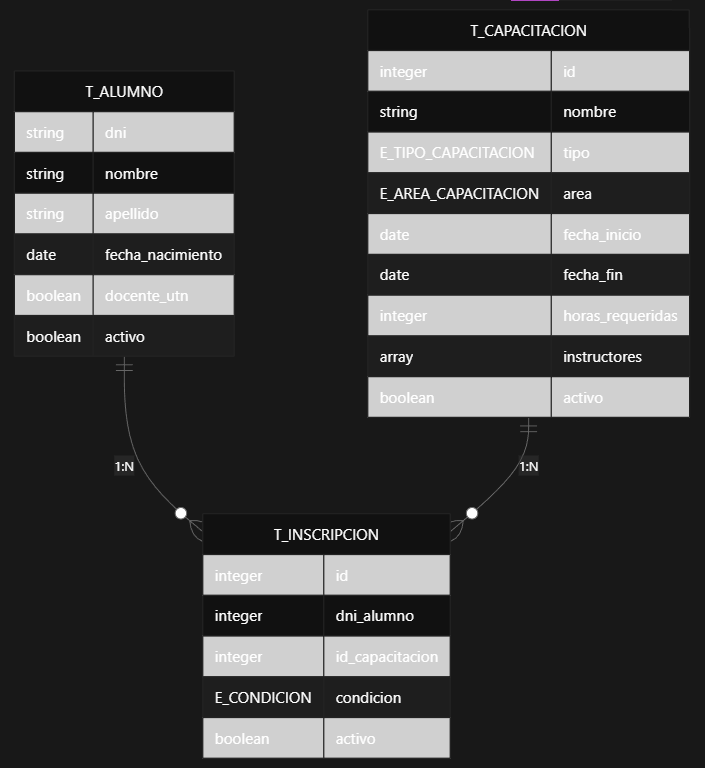
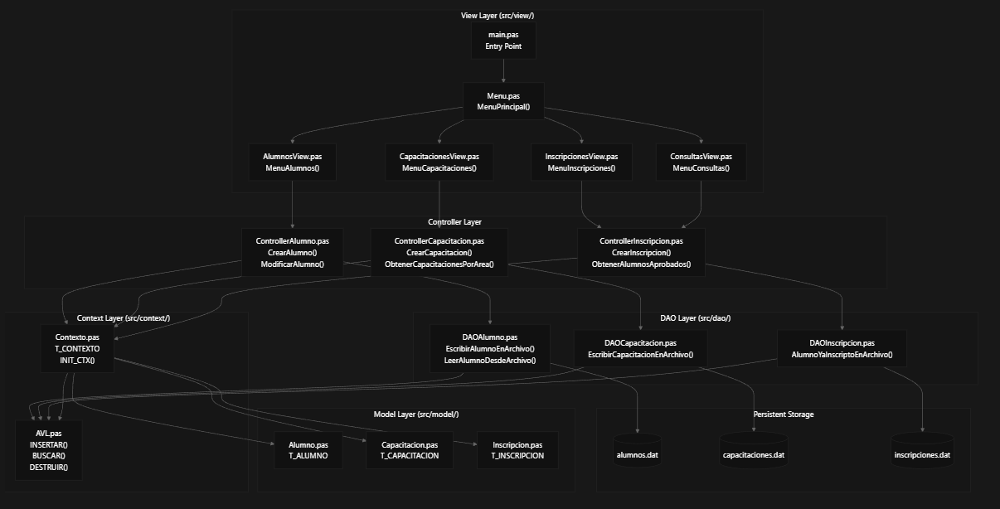
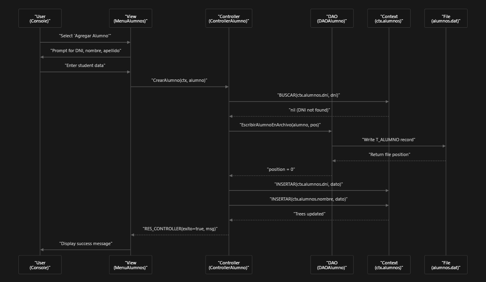

# Propósito del Sistema

**FRCU-capacitaciones** es un sistema de gestión de inscripciones para la Facultad Regional Concepción del Uruguay (FRCU).  
El sistema administra alumnos (tanto externos como docentes de la UTN), capacitaciones (cursos, talleres y seminarios) y registros de inscripción que vinculan alumnos con actividades de formación.  

Provee operaciones **CRUD** para cada tipo de entidad y permite generar reportes tales como:
- Listados de alumnos aprobados  
- Certificados de inscripción  
- Distribuciones estadísticas por departamento académico  

El sistema funciona como una aplicación de consola **standalone** con persistencia basada en archivos.  
Todos los datos se almacenan en archivos binarios (`alumnos.dat`, `capacitaciones.dat`, `inscripciones.dat`) y son indexados en memoria mediante árboles **AVL** para permitir búsquedas eficientes.

---

# Entidades Principales

El sistema gestiona tres tipos principales de entidades, cada una definida mediante registros (records) de Pascal:

| Tipo de Entidad      | Tipo de Registro      | Identificador Clave | Archivo de Almacenamiento   |
|----------------------|------------------------|----------------------|------------------------------|
| **Alumno**           | `T_ALUMNO`             | `dni` (DNI)          | `alumnos.dat`                |
| **Capacitación**     | `T_CAPACITACION`       | `id` (identificador) | `capacitaciones.dat`         |
| **Inscripción**      | `T_INSCRIPCION`        | `id` (autogenerado)  | `inscripciones.dat`          |

---

## Relaciones Entre Entidades

- Un **alumno** puede inscribirse en muchas capacitaciones (**1:N**).  
- Una **capacitación** puede tener muchos alumnos inscriptos (**1:N**).  
- `T_INSCRIPCION` implementa la relación **muchos-a-muchos (N:M)** actuando como entidad intermedia.  

Cada entidad incluye un campo booleano **activo**, que implementa *soft deletion*:  
los registros no se eliminan físicamente, sino que se marcan como inactivos para conservar historial y mantener la integridad referencial.



# Arquitectura de Cinco Capas

El sistema aplica dependencias estrictamente unidireccionales entre **cinco capas arquitectónicas**, asegurando separación de responsabilidades y evitando acoplamiento innecesario.



En conjunto, estas capas implementan un flujo uniforme, claro y desacoplado para todas las operaciones del sistema, manteniendo integridad, eficiencia y facilidad de mantenimiento.

# Responsabilidades por Capa:

## **Model** Layer (Capa 1)

Define las estructuras de datos puras sin lógica de negocio:
- `Alumno.pas`: Define `T_ALUMNO` con DNI, datos personales y flag `docente_utn`
- `Capacitacion.pas`: Define `T_CAPACITACION` con tipo, área, fechas e instructores
- `Inscripcion.pas`: Define `T_INSCRIPCION` que vincula alumnos con capacitaciones

## **Context** Layer (Capa 2)
Mantiene índices en memoria usando árboles AVL para búsquedas eficientes:
- `Contexto.pas` define `T_CONTEXTO` que contiene 5 árboles AVL:
    ```pascal
        // context/Contexto.pas

        T_CONTEXTO = record
            alumnos: T_CONTEXTO_ALUMNOS;
            capacitaciones: T_CONTEXTO_CAPACITACIONES;
            inscripciones: T_CONTEXTO_INSCRIPCIONES;
        end;
    ```
  - `T_CONTEXTO`: Alumnos indexados por DNI y nombre
  - `T_CONTEXTO_CAPACITACIONES`: Capacitaciones indexadas por ID y nombre
  - `T_CONTEXTO_INSCRIPCIONES`: Inscripciones indexadas por ID
  
  `INIT_CTX` carga todos los datos desde archivos a los árboles AVL. Ejemplo: 

  ```pascal
    // context/Contexto.pas

    procedure INIT_CTX(var ctx: T_CONTEXTO);
    begin
        { Carga el Árbol de alumnos ordenado por dni con informacion de archivos } 
        CargarAlumnosAVL(ctx.alumnos.dni, ca_dni);

        { Carga el Árbol de alumnos ordenado por nombre con informacion de archivos } 
        CargarAlumnosAVL(ctx.alumnos.nombre, ca_nombre);

        { Carga el Árbol de capacitaciones ordenado por id con informacion de archivos } 
        CargarCapacitacionesAVL(ctx.capacitaciones.id, cc_id);

        { Carga el Árbol de capacitaciones ordenado por nombre con informacion de archivos } 
        CargarCapacitacionesAVL(ctx.capacitaciones.nombre, cc_nombre);
        
        { Carga el Árbol de inscripciones ordenado por id con informacion de archivos } 
        CargarInscripcionesAVL(ctx.inscripciones.id, ci_id);
    end;
    ```


## **DAO** Layer (Capa 3)
Encapsula operaciones de acceso a archivos binarios:
- `DAOAlumno.pas`: Opera sobre `alumnos.dat`
- `DAOCapacitacion.pas`: Opera sobre `capacitaciones.dat`
- `DAOInscripcion.pas`: Opera sobre `inscripciones.dat`
- Implementa CRUD y eliminación lógica (soft delete)

Ejemplo:

```pascal
// dao/DAOAlumno.pas

unit DAOAlumno;

interface 
    uses Alumno, AVL;

    // Para el contexto
    procedure CargarAlumnosAVL(var arbol_alumnos: PUNT_NODO; campo: E_CAMPOS_ALUMNO);

    // Para los controladores
    function EscribirAlumnoEnArchivo(alumno : T_ALUMNO): integer;
    procedure LeerAlumnoDesdeArchivo(var alumno : T_ALUMNO; pos: integer);
    procedure ModificarAlumnoDeArchivo(alumno: T_ALUMNO; pos: integer);

implementation
    uses SysUtils, DAOUtils;
    const RUTA = './data/alumnos.dat';

        function EscribirAlumnoEnArchivo(alumno : T_ALUMNO): integer;
    var 
        archivo : T_ARCHIVO_ALUMNO;
        pos: integer;
    begin
        Assign(archivo, RUTA);
        ChechearCarpetaYArchivoExisten(RUTA, archivo);

        Reset(archivo);
        pos := FileSize(archivo);
        Seek(archivo, pos);
        Write(archivo, alumno);

        Close(archivo);

        EscribirAlumnoEnArchivo:= pos;
    end;

    ...
```

## **Controller** Layer (Capa 4)

La capa **Controller** implementa la lógica de negocio de la aplicación. Recibe solicitudes desde la **Vista**, valida los datos, coordina las operaciones entre el **DAO** y los distintos contextos, y retorna una respuesta unificada.

### Controladores disponibles
- **`ControllerAlumno.pas`**:  
  Valida datos de alumnos, gestiona actualizaciones en los contextos y retorna un `ALUMNO_RES_CONTROLLER`.

- **`ControllerCapacitacion.pas`**:  
  Administra capacitaciones, filtrado por área, fechas y estado. Retorna un `CAPACITACION_RES_CONTROLLER`.

- **`ControllerInscripcion.pas`**:  
  Maneja inscripciones, validaciones y condiciones de aprobación. Retorna un `INSCRIPCION_RES_CONTROLLER`.

### Formato de respuesta de los controladores

Todos los controladores retornan una estructura común que funciona como “interfaz” entre el controlador y la vista.  
Cada respuesta incluye:

- `error: boolean` — indica si ocurrió un error en la operación.  
- `msg: string` — mensaje descriptivo para la vista.  
- `data: <Lista>` — datos resultantes de la operación.

Ejemplo:

```pascal
// controller/ControllerAlumno.pas

type
    ALUMNO_RES_CONTROLLER = record
        error: boolean;
        msg: string;
        data: LISTA_ALUMNOS;
    end;
```

## **View** Layer (Capa 5)
Maneja interacción con usuario por consola :
- `Menu.pas`: Navegación principal con menú interactivo 
- `AlumnosView.pas`, `CapacitacionesView.pas`, 
`InscripcionesView.pas`: Menús específicos por entidad
- `ConsultasView.pas`: Consultas cruzadas entre entidades


## Flujo una Operación CRUD

Todas las operaciones CRUD siguen este patrón de solicitud–respuesta. 

Ejemplo del flujo típico de una Operación CRUD (Ejemplo: crear Alumno)

1. **Capa View** recopila la entrada del usuario y determina qué procedimiento del controlador debe invocar.  
2. **Capa Controller** valida la operación (por ejemplo, verificando si existe un DNI duplicado mediante el contexto).  
3. **Capa DAO** realiza operaciones de lectura/escritura en archivos binarios de tamaño fijo.  
4. **Capa Controller** actualiza los árboles AVL del contexto para reflejar los cambios en el archivo.  
5. **Capa View** muestra al usuario el resultado de la operación.  



El **contexto (`ctx`)** se pasa por referencia a lo largo de todas las capas, permitiendo que controladores y DAOs consulten y actualicen los índices en memoria sin acoplarse a la Vista.  

Los controladores retornan estructuras `RES_CONTROLLER` que incluyen indicadores de éxito y mensajes para el usuario.

## Notas
- La arquitectura en capas permite mantenibilidad, escalabilidad y claridad en las responsabilidades
- Los árboles AVL en el Context proporcionan búsquedas O(log n) sin cargar todos los datos en memoria
- El soft delete (campo `activo`) preserva integridad referencial en inscripciones
- Cada entidad tiene sus propios módulos View/Controller/DAO siguiendo un patrón paralelo

---

# Compilación del Proyecto

Este proyecto puede compilarse tanto en **Linux** como en **Windows** utilizando los scripts incluidos en el repositorio. Para ambos sistemas operativos es necesario tener instalado el compilador **Free Pascal (FPC)**.

---

## Requisitos

- Free Pascal (FPC) instalado y agregado al PATH.  
  Descarga disponible en: https://www.freepascal.org/download.var

Para verificar la instalación:

```bash
fpc -i
```
Si el comando responde con información del compilador, está correctamente instalado.

# Compilación

El proyecto incluye dos scripts:

- `compilar-linux.sh` — para sistemas basados en Linux.
- `compilar-win.bat` — para sistemas Windows.

Ambos scripts realizan exactamente las mismas tareas, adaptadas al sistema operativo correspondiente.

---
## ¿Qué hacen los scripts de compilación?

Independientemente de la plataforma, el proceso automatizado ejecuta los siguientes pasos:

### 1. Crear el directorio `/bin`
Si no existe, se genera la carpeta donde se almacenará el ejecutable.

### 2. Compilar todas las units  
En el siguiente orden (por dependencias internas):

#### Modelos
- `src/model/Capacitacion.pas`  
- `src/model/Alumno.pas`  
- `src/model/Inscripcion.pas`

#### Utilidades
- `src/utils/AVL.pas`  
- `src/utils/List.pas`  
- `src/utils/DAOUtils.pas`  
- `src/utils/Utils.pas`  
- `src/utils/ViewUtils.pas`

#### Acceso a Datos (DAO)
- `src/dao/DAOAlumno.pas`  
- `src/dao/DAOCapacitacion.pas`  
- `src/dao/DAOInscripcion.pas`

#### Contexto
- `src/context/Contexto.pas`

#### Controladores
- `src/controller/ControllerAlumno.pas`  
- `src/controller/ControllerCapacitacion.pas`  
- `src/controller/ControllerInscripcion.pas`

#### Vistas
- `src/view/AlumnosView.pas`  
- `src/view/CapacitacionesView.pas`  
- `src/view/InscripcionesView.pas`  
- `src/view/ConsultasView.pas`  
- `src/view/Menu.pas`

### 3. Compilar el programa principal
- `src/main.pas`

El ejecutable generado se guardará como:
```bash
bin/FRCU-capacitaciones
```
o en Windows:
```bash
bin/FRCU-capacitaciones.exe
```

### 4. Limpieza de archivos temporales
Ambos scripts eliminan automáticamente:

- `.o`
- `.ppu`

---

# Cómo compilar
### En Linux

Dar permisos de ejecución:

```bash
chmod +x compilar-linux.sh
```

Ejecutar:

```bash
./compilar-linux.sh
```

### En Windows

Ejecutar haciendo doble clic en:
```cmd
compilar-win.bat
```
# Ejecución

Una vez compilado correctamente, abrir la carpeta `bin` y ejecutar el archivo generado:

- `FRCU-capacitaciones` (en Linux)
- `FRCU-capacitaciones.exe` (en Windows)

---
### Notas
- No se requiere ninguna dependencia adicional fuera de Free Pascal.

- Los scripts detendrán la compilación automáticamente si detectan un error en cualquiera de las units.